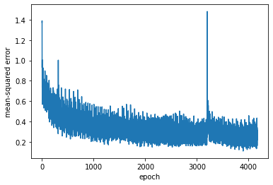
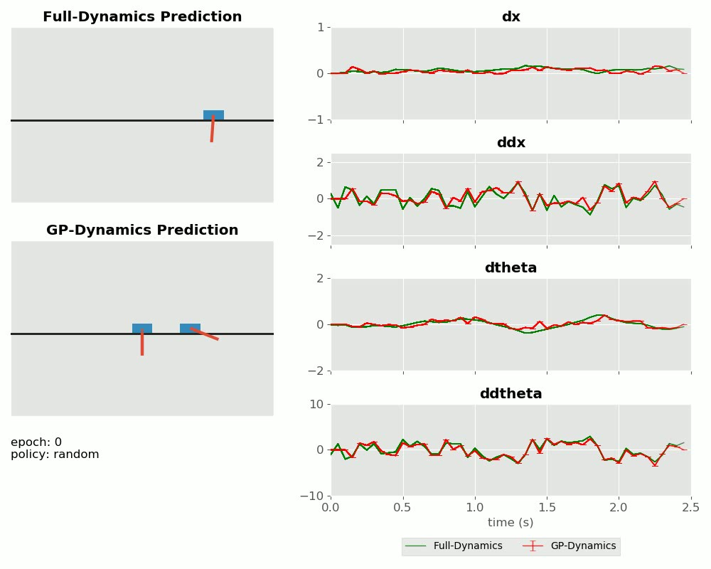
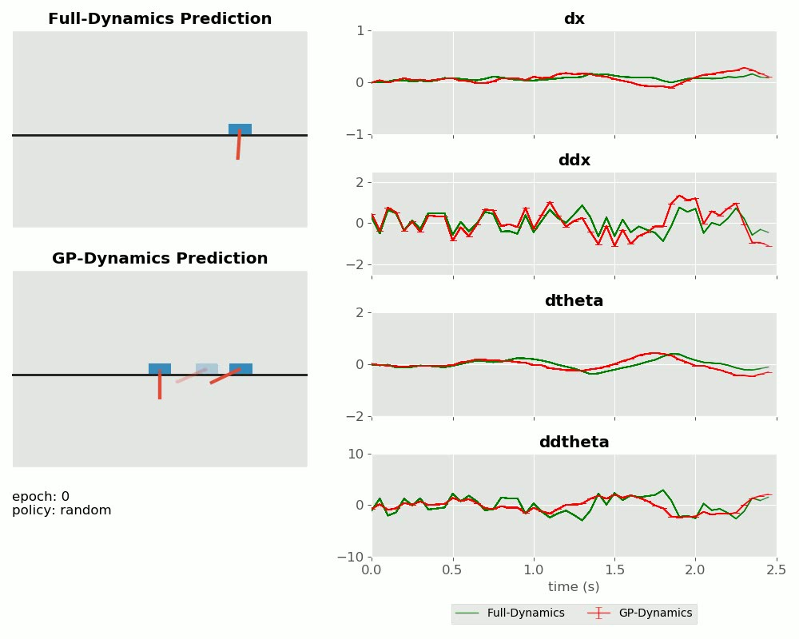
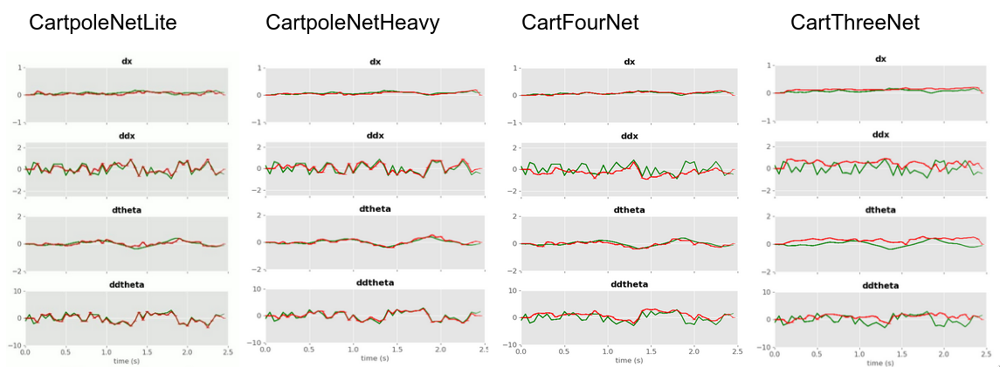
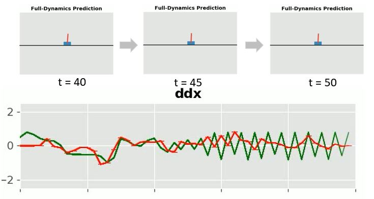

# Predicting delta states from images with CNN

## Problem statement
Given n-1 consecutive image frames before and including time instant t (i.e., t-n+1, ..., t) and 1 image from after (i.e., t+1) from a cartpole dynamics simulation, predict the delta state (dx, ddx, dtheta, ddtheta) between time instants t and t+1.


## System overview
### Neural network architectures

All input images are 128 x 128 grayscale images.

We explored four neural networks: two versions for five input images (heavy and lite - to determine effect of NN size on NN predicted delta states MSE), and two versions lesser number of input images (4 and 3 - to determine effect of number of images on NN predicted delta states MSE)

|                               | CartpoleNetLite | CartpoleNetHeavy | CartFourNet | CartThreeNet |
|-------------------------------|-----------------|------------------|-------------|--------------|
| Conv3D layers                 |               3 |                4 |           4 |            4 |
| Fully connected layers        |               3 |                5 |           5 |            5 |
| number of input images        |               5 |                5 |           4 |            3 |
| number of training iterations |             25k |              10k |         10k |          10k |

All neural networks use ReLU activation function, and Adam optimizer.

#### CartpoleNetLite
```python
class CartpoleNetLite(nn.Module):
  def __init__(self):
    super(CartpoleNetLite, self).__init__()
    self.conv1 = nn.Conv3d(1, 8, 3, padding=1) 
    self.conv2 = nn.Conv3d(8, 16, 3, padding=1)
    self.conv3 = nn.Conv3d(16, 32, 3, padding=1)
    self.fc1 = nn.Linear(16 * 16 * 32, 256)
    self.fc2 = nn.Linear(256, 128)
    self.fc3 = nn.Linear(128, 4)

  def forward(self, x):
    x = F.max_pool3d(F.relu(self.conv1(x)), (1,2,2)) # 64x64
    x = F.max_pool3d(F.relu(self.conv2(x)), (1,2,2)) # 32x32
    x = F.max_pool3d(F.relu(self.conv3(x)), (1,2,2)) # 16x16
    x = torch.sum(x, axis=2)
    x = x.view(-1, self.num_flat_features(x))
    x = F.relu(self.fc1(x))
    x = F.relu(self.fc2(x))
    x = self.fc3(x)
    return x

  def num_flat_features(self, x):
    size = x.size()[1:]  # all dimensions except the batch dimension
    num_features = 1
    for s in size:
        num_features *= s
    return num_features
```
#### CartpoleNetHeavy
```python
class CartpoleNetHeavy(nn.Module):
  def __init__(self):
    super(CartpoleNetHeavy, self).__init__()
    self.conv1 = nn.Conv3d(1, 8, 3, padding=1) 
    self.conv2 = nn.Conv3d(8, 16, 3, padding=1)
    self.conv3 = nn.Conv3d(16, 32, 3, padding=1)
    self.conv4 = nn.Conv3d(32, 64, 3, padding=1)
    self.fc1 = nn.Linear(8 * 8 * 64, 1024)
    self.fc2 = nn.Linear(1024, 512)
    self.fc3 = nn.Linear(512, 256)
    self.fc4 = nn.Linear(256, 128)
    self.fc5 = nn.Linear(128, 4)

  def forward(self, x):
    x = F.max_pool3d(F.relu(self.conv1(x)), (1,2,2)) # 64x64
    x = F.max_pool3d(F.relu(self.conv2(x)), (1,2,2)) # 32x32
    x = F.max_pool3d(F.relu(self.conv3(x)), (1,2,2)) # 16x16
    x = F.max_pool3d(F.relu(self.conv4(x)), (1,2,2)) # 16x16
    x = torch.sum(x, axis=2)
    x = x.view(-1, self.num_flat_features(x))
    x = F.relu(self.fc1(x))
    x = F.relu(self.fc2(x))
    x = F.relu(self.fc3(x))
    x = F.relu(self.fc4(x))
    x = self.fc5(x)
    return x
```
#### CartFourNet
```python
class CartFourNet(nn.Module):
  def __init__(self):
    super(CartFourNet, self).__init__()
    self.conv1 = nn.Conv3d(1, 8, 3, padding=1) 
    self.conv2 = nn.Conv3d(8, 16, 3, padding=1)
    self.conv3 = nn.Conv3d(16, 32, 3, padding=1)
    self.conv4 = nn.Conv3d(32, 64, 3, padding=1)
    self.fc1 = nn.Linear(8 * 8 * 64, 1024)
    self.fc2 = nn.Linear(1024, 512)
    self.fc3 = nn.Linear(512, 256)
    self.fc4 = nn.Linear(256, 128)
    self.fc5 = nn.Linear(128, 4)

  def forward(self, x):
    x = F.max_pool3d(F.relu(self.conv1(x)), (1,2,2)) # 64x64
    x = F.max_pool3d(F.relu(self.conv2(x)), (1,2,2)) # 32x32
    x = F.max_pool3d(F.relu(self.conv3(x)), (1,2,2)) # 16x16
    x = F.max_pool3d(F.relu(self.conv4(x)), (1,2,2)) # 16x16
    x = torch.sum(x, axis=2)
    x = x.view(-1, self.num_flat_features(x))
    x = F.relu(self.fc1(x))
    x = F.relu(self.fc2(x))
    x = F.relu(self.fc3(x))
    x = F.relu(self.fc4(x))
    x = self.fc5(x)
    return x
```
#### CartThreeNet
```python
class CartThreeNet(nn.Module):
  def __init__(self):
    super(CartThreeNet, self).__init__()
    self.conv1 = nn.Conv3d(1, 8, 3, padding=1) 
    self.conv2 = nn.Conv3d(8, 16, 3, padding=1)
    self.conv3 = nn.Conv3d(16, 32, 3, padding=1)
    self.conv4 = nn.Conv3d(32, 64, 3, padding=1)
    self.fc1 = nn.Linear(8 * 8 * 64, 1024)
    self.fc2 = nn.Linear(1024, 512)
    self.fc3 = nn.Linear(512, 256)
    self.fc4 = nn.Linear(256, 128)
    self.fc5 = nn.Linear(128, 4)

  def forward(self, x):
    x = F.max_pool3d(F.relu(self.conv1(x)), (1,2,2)) # 64x64
    x = F.max_pool3d(F.relu(self.conv2(x)), (1,2,2)) # 32x32
    x = F.max_pool3d(F.relu(self.conv3(x)), (1,2,2)) # 16x16
    x = F.max_pool3d(F.relu(self.conv4(x)), (1,2,2)) # 16x16
    x = torch.sum(x, axis=2)
    x = x.view(-1, self.num_flat_features(x))
    x = F.relu(self.fc1(x))
    x = F.relu(self.fc2(x))
    x = F.relu(self.fc3(x))
    x = F.relu(self.fc4(x))
    x = self.fc5(x)
    return x
```

### Training dataset
We generated 220 epochs worth of data, where each epoch contains 50 images. For the 5 input image neural networks, each epoch produces 46 training examples, or 10,120 training examples from the entire [training dataset](./data/image_dataset).

### Test dataset
We generated 2 epochs of 50 images each for the [testing dataset](./data/image_test_datset) the MSE between the trained NN predictions and actual delta states from the simulator.

## Training
- We used mini-batch gradient descent with batches of 128 training examples and train four neural networks as described previously.
- We used a dataloader to send the inputs (the training dataset, a (N x C x D x H x W) 5D torch tensor) , and the corresponding labels ((n x 4) torch tensor containing the delta states for the same time stamps) to train the CNNs. It was an iterator that, given an index i from the training data, returned a tuple containing the inputs and labels from time steps (i-n+1) to (i+1) for n images. Here,
  - N = number of training datapoints in each batch
  - C = number of channels in the image (1 for this case, since it was a grayscale image)
  - D = number of images in one datapoint (we tested for 5, 4, and 3)
  - (W,H) = image dimensions (128 x 128)
- Training curve for CartpoleNetLite (complete training curve and averaged per 100 iterations):


Similar curves were observed for the other NNs too.

## Results
|               | CartpoleNetLite | CartpoleNetHeavy | CartFourNet | CartThreeNet |
|---------------|-----------------|------------------|-------------|--------------|
| test data MSE |         0.06464 |          0.00531 |     0.00855 |      0.10573 |

- CartpoleNetLite is able to reliably predict the dynamics with a low MSE.

- Deep neural networks can be better predictors than other methods like Gaussian processes applied to specific problems:

- Deeper neural networks perform better than an equivalent "lite" version (eg. compare the videos for CartpoleNetLite and CartpoleNetHeavy). Also, NNs that take more number of images as inputs perform better than those that take in less number of images (eg. compare the videos for CartpoleNetLite, CartFourNet and CartThreeNet).


### NN predictions compared to ground truth from the simulator
#### CartpoleNetLite

https://user-images.githubusercontent.com/14308382/140626934-42114ecf-5f7b-486a-9bd5-d01ae91976e7.mov

#### CartpoleNetHeavy

https://user-images.githubusercontent.com/14308382/140626941-025943ef-fd77-483b-abfc-24faadba17d2.mov

#### CartFourNet

https://user-images.githubusercontent.com/14308382/140626950-14f66dda-0610-4ca1-b4f4-3809b76e7b68.mov

#### CartThreeNet

https://user-images.githubusercontent.com/14308382/140626953-91b397ed-022d-4ddf-ac06-328e7acb61e3.mov

### Limitations
- The NNs can also not make predictions on its previous predictions due to the way the data is structured (unlike Gaussian processes).
- The neural networks are not able to predict the (delta for first order derivatives, eg. velocity) dynamics well when the pole is not moving (eg. when it is at a standstill at an equilibrium).


This could be due to several reasons:
  - During a standstill the last n frames may not contain enough information to determine the velocity. Ground truth ddx may be oscillating rapidly between small positive and negative values, but the CNN predicts ddx to be 0 since there is no movement of the cartpole. This makes it difficult to determine what the ddx values are in these circumstances.
  - It could also be possible that the training dataset does not contain enough number of a swing-up policy.
- The NNs cannot predict the delta states till the (n-1)th timestep since the previous images are required as inputs. Similarly, they cannot predict delta states for the last timestep since an "after" image is also required.
- Even though the theoretical minimum number of images required to make predictions for delta of first order derivatives (eg. velocities) is 3, in practice, CartThreeNet does not perform very well for ddx and ddtheta (though it tracks dx and dtheta well enough).

## Requirements
- pytorch
- numpy
- scipy
- opencv
- pandas
- matplotlib

## Description of repository contents
- [data](./data) contains the generated datasets
  - [data/image_dataset](./data/image_dataset) contains the training dataset
  - [data/image_test_dataset](./data/image_test_dataset) contains the testing dataset
- [figures](./figures) contains images used in the readme and the final report
- [GPNet](./GPNet) is the practice neural network that was used to predict delta states given augmented states. 
- [results](./results) shows videos of all four neural networks. 
- [src](./src) contains the CNN used to predict the delta states of the cartpole. In this directory, run
```sh
python cartpole_preds_with_nn.py
```
to visualize the NN performance.
- [src/models](./src/models) contains the architectures of the CNNs.

## Authors
- [Mino Nakura](https://nakuramino.github.io/)
- [Nishant Elkunchwar](https://students.washington.edu/nishante)
- [Pratik Gyawali](https://www.linkedin.com/in/pratikgyawali)

## Acknowledgements
This project was a course project for CSE 571 AI-based mobile robotics (Spring 2020) at the University of Washington. The authors would like to thank [Prof. Dieter Fox](https://homes.cs.washington.edu/~fox/) and the course TAs, [Xiangyun Meng](https://homes.cs.washington.edu/~xiangyun/) and [Chris Xie](https://chrisdxie.github.io/) for guidance and for providing the simulation environment. The [project report](./CSE_571_Project_1_Final_Report.pdf) and the [video presentation](https://www.youtube.com/watch?v=WPA_Rgqnl0Y) are also linked here.
